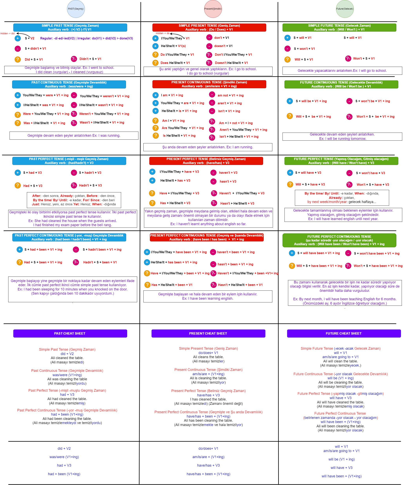
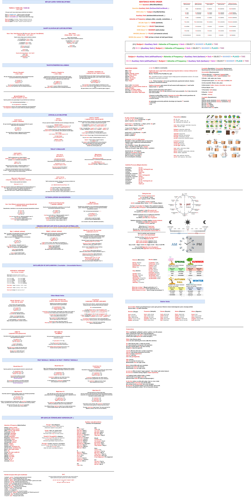

## What is my goal ?
- My goal here is to put together universal English formulas.
- You can change the formulas to match your language.
- I know I can make mistakes. You can tell my mistakes by clicking the "Issues" button.

## How can you change these formulas ?
- You can download the general.drawio file [here.](general.drawio)
- Next, you can open the general.drawio on this website app.diagrams.net or draw.io

## All English Formulas
- `12 English Tenses` %92
- `All Modals` %70
- `General` %50

## Bonus
- `Storybooks` %10
- `Books` %40
- `Helper Kits` %25
- `Words` %40

## Chat Bots
- https://replika.ai/ or https://play.google.com/store/apps/details?id=ai.replika.app
- https://www.cleverbot.com/

## Social Platform
- https://discord.gg/english

## Books
- ### Comics
- https://comicbookplus.com/
- https://view-comic.com/

## Turkish -> English Sources For Turkish People

### `Web Sources`
- https://ingilizcebankasi.com
- https://dersimizingilizce.com
- https://blog.cambly.com/tr/
- https://etkilipratikingilizce.com/
- https://www.ef.com.tr/ingilizce-ogreniyorum/ingilizce-gramer/
- https://nasilokunur.net/
- https://www.okunusu.com/

### `Youtube Sources`
- https://www.youtube.com/c/EtkiliPratikİngilizce - Etkili Pratik İngilizce
- https://www.youtube.com/channel/UCqt17-JtaqchXgU4fFunz6w - FikirHastası
- https://www.youtube.com/c/ingilizcekonuanlatimi - İngilizce Konu Anlatımı - Özer Kiraz
- https://www.youtube.com/c/ÇilemAkar - Çilem Akar
- https://www.youtube.com/channel/UC3GgF1Mlc400cRzVE-9vsFg - Bahar Şahin
- https://www.youtube.com/channel/UCyaeK2QAUXoeL1iYykgFHIg - Özkan Çelen
- https://www.youtube.com/playlist?list=PLxX2m2Np79VdHxkH0s43UTp9CfwBg_NmE - Haluk Tatar
- https://www.youtube.com/c/dillendim - Dillendim
- https://www.youtube.com/c/EnglishWithZack1 - English With Zack
- https://www.youtube.com/c/RuriOhama - Ruri Ohama

## English Sources

### `Web Sources`
- https://learnenglish.britishcouncil.org
- https://learningenglish.voanews.com
- https://www.usingenglish.com
- https://www.englishclub.com/

### `Youtube Sources`
- https://www.youtube.com/channel/UC_XZoWueXyWuwVG4B_AEmmg - Arnel's Everyday English
- https://www.youtube.com/c/EnglishwithLucy - English with Lucy
- https://www.youtube.com/channel/UCeTVoczn9NOZA9blls3YgUg - Learn English with EnglishClass101.com
- https://www.youtube.com/channel/UCiLADGxdlggDc14zkO2CVlQ - Learn English with English7Levels
- https://www.youtube.com/watch?v=k89GF-i_Eyg&list=PLfFN2W7YMYBSKji3sfXxpNQyyi1lr8OzK - Christopher Britt

## Dictionaries
- https://tureng.com
- https://dictionary.cambridge.org/
- https://www.zargan.com
- https://www.urbandictionary.com/

## Helper Websites
- https://quillbot.com/grammar-check
- https://textranch.com/
- https://play.aidungeon.io
- https://hemingwayapp.com/
- https://www.matecat.com/
- https://www.wordhippo.com/
- https://www.youtube.com/channel/UC7fPdB9IGwWyba2X09K1yNQ
- https://youglish.com/
- https://readlistenlearn.net/
- https://elllo.org/
- https://lyricstraining.com/ and app 
- https://www.newsinlevels.com/

## Contributors
- `Gwyneth`

## Preview

### 12 Tenses in English Grammar - (to be revised) 

### General - (to be revised)
